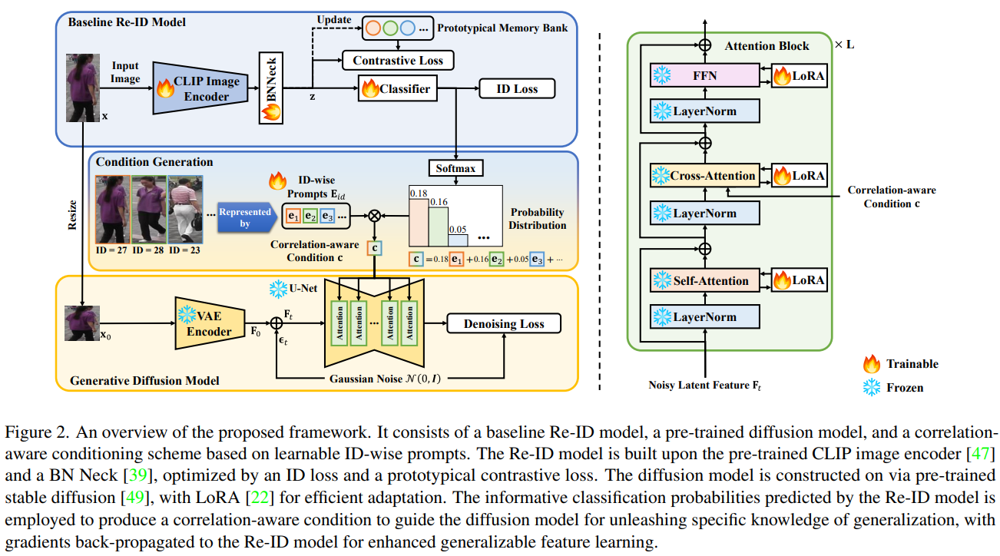
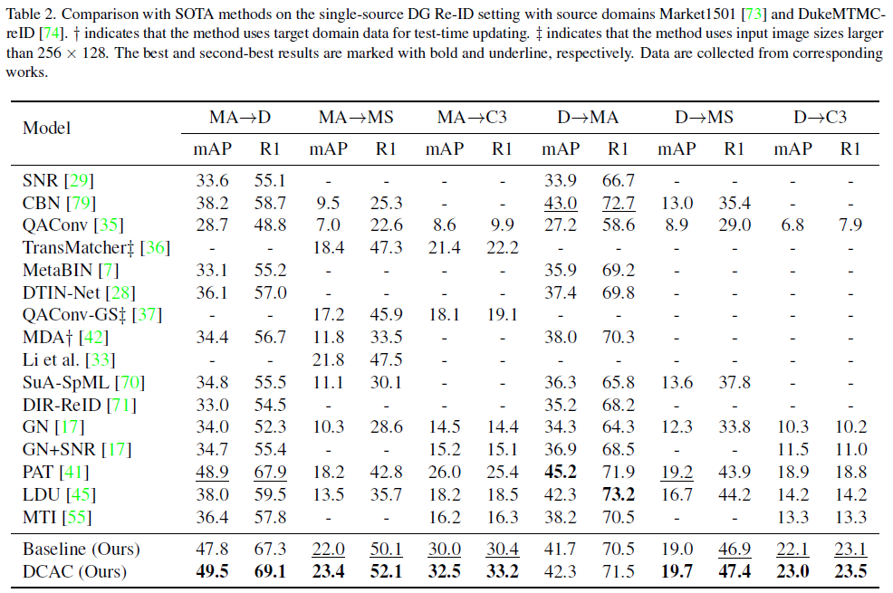
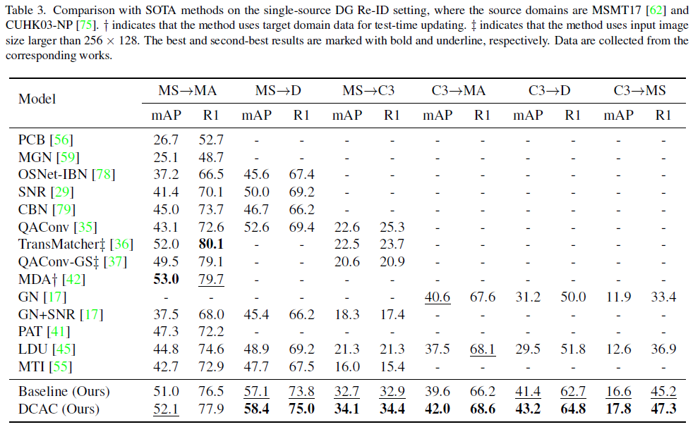
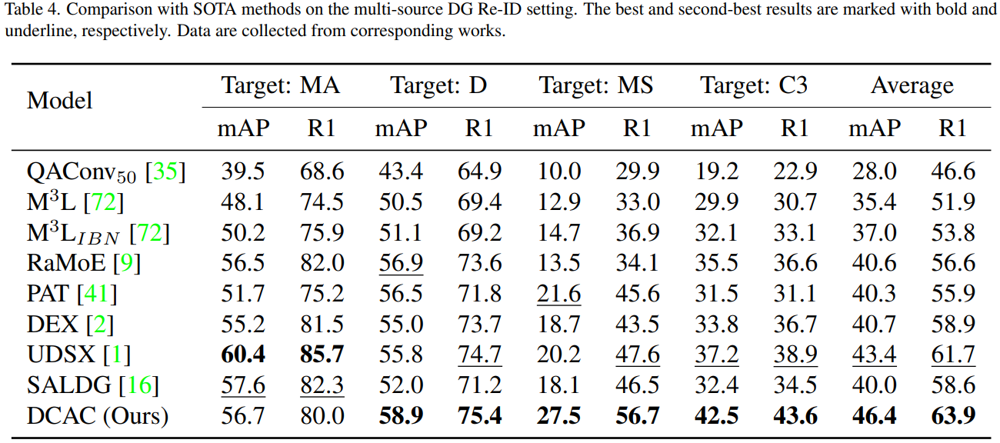

# Unleashing the Potential of Pre-Trained Diffusion Models for Generalizable Person Re-Identification


[](https://paperswithcode.com/sota/generalizable-person-re-identification-on-21?p=unleashing-the-potential-of-pre-trained)
[](https://paperswithcode.com/sota/generalizable-person-re-identification-on-23?p=unleashing-the-potential-of-pre-trained)
[](https://paperswithcode.com/sota/generalizable-person-re-identification-on-22?p=unleashing-the-potential-of-pre-trained)
[](https://paperswithcode.com/sota/generalizable-person-re-identification-on-20?p=unleashing-the-potential-of-pre-trained)


Official implementation code for the paper [Unleashing the Potential of Pre-Trained Diffusion Models for Generalizable Person Re-Identification](todo).

In this work, we propose a novel method called diffusion model-assisted representation learning with a correlation-aware conditioning scheme (DCAC) to enhance DG Re-ID. Our method integrates a discriminative and contrastive Re-ID model with a pre-trained diffusion model through a correlation-aware conditioning scheme. By incorporating ID classification probabilities generated from the Re-ID model with a set of learnable ID-wise prompts, the conditioning scheme injects dark knowledge that captures ID correlations to guide the diffusion process. Simultaneously, feedback from the diffusion model is back-propagated through the conditioning scheme to the Re-ID model, effectively improving the generalization capability of Re-ID features.

## Upload History

**2025/2/11**

- [x] Initiate README
- [x] Upload codes

**TODO**

- [ ] Upload checkpoints


## Pipeline



## Installation

Create a python environment and install dependencies in `requirements.txt`.

```bash
conda create -n dcac python=3.10
conda activate dcac
pip install -r requirements.txt
```

### Prerequisites

Clone this repository to your own device.

```bash
git clone https://github.com/RikoLi/DCAC.git
cd DCAC
```

Unzip and place the root folder of each dataset in `data` under the root directory of this repository, for example:

```
DCAC/
  └─data/
       ├─Market1501/
       ├─DukeMTMC-reID/
       └─MSMT17/
```

#### Pre-trained Diffusion Weight

We use `stable-diffusion-v1-5`, which you can find it on [🤗Huggingface](https://huggingface.co/stable-diffusion-v1-5/stable-diffusion-v1-5). We use the full weight [`v1-5-pruned.ckpt`](https://huggingface.co/stable-diffusion-v1-5/stable-diffusion-v1-5/blob/main/v1-5-pruned.ckpt) for fine-tuning. Download the pre-trained weight and put it in a new folder `pretrained`.

```bash
mkdir pretrained && cd pretrained
wget https://huggingface.co/stable-diffusion-v1-5/stable-diffusion-v1-5/blob/main/v1-5-pruned.ckpt
```

#### Configuration

We use [:cat:AlchemyCat](https://github.com/HAL-42/AlchemyCat) configuration system to support efficient experiment management. You can directly install it through CLI:

```bash
pip install alchemy-cat
```

Please refer to its official guide for basic configuration settings.

## Training

We have prepared several configuration files to directly start training.

```bash
# e.g. ma -> ms training
CUDA_VISIBLE_DEVICES=0 python train_neko_sd.py --config_file alchemycat_configs/single-source/ma_to_ms/cfg.py

# e.g. d+ms+c3 -> ma
CUDA_VISIBLE_DEVICES=0 python train_neko_sd.py --config_file alchemycat_configs/multi-source/d+ms+c3_to_ma/cfg.py
```

For custom training, you can edit the training script and write your own configs by referring to the official guide of [AlchemyCat](https://github.com/HAL-42/AlchemyCat).

Training logs will be saved to `logs` folder under the root directory by default, where each experiment will creates a new subfolder sharing the name of the corresponding configuration folder.

## Evaluation

With pre-trained checkpoints, you can run the evaluation on the given target domain by passing the name of the dataset to `cfg.TEST.WEIGHT`. For example:

```bash
# Assume that you write a new config for evaluation in alchemycat_configs/test/cfg.py
CUDA_VISIBLE_DEVICES=0 python train_neko_sd.py --test --config_file alchemycat_configs/test/cfg.py
```

Assume that you have the weight `logs/single-source/ma_to_ms/ViT-B-16_stage2_60.pth`, in the corresponding `cfg.py` you need to specify the weight path in a line:

```python
cfg.TEST.WEIGHT = "logs/single-source/ma_to_ms/ViT-B-16_stage2_60.pth"
```

## Checkpoints

We release the checkpoints trained on multiple source domains with the implementation details described in the paper. Checkpoints are packed in a `tar` file and uploaded to [OneDrive](xxxxx). You can refer to following table to find details of each checkpoint.

Source Domain | Target Domain | Protocol | Checkpoint Name
:--: | :--: | :--: | :--:
MA | any | single-source | `source_ma.pth`
D | any | single-source | `source_d.pth`
MS | any | single-source | `source_ms.pth`
C3 | any | single-source | `source_c3.pth`
MA+D+MS | C3 | multi-source | `source_ma+d+ms.pth`
MA+D+C3 | MS | multi-source |`source_ma+d+c3.pth`
MA+MS+C3 | D | multi-source |`source_ma+ms+c3.pth`
D+MS+C3 | MA | multi-source |`source_d+ms+c3.pth`

## Performance

### Single-source DG



### Multi-source DG


## Acknowledgement

Our implementation mainly refers to [CLIP-ReID](https://github.com/Syliz517/CLIP-ReID) and [stable-diffusion](https://github.com/CompVis/stable-diffusion). Thanks to their amazing works!

## Citation

If you feel our work helpful in your research, please cite it like this:

```bibtex
@article{li2025unleashing,
  title={Unleashing the Potential of Pre-Trained Diffusion Models for Generalizable Person Re-Identification},
  author={Li, Jiachen and Gong, Xiaojin},
  journal={arXiv preprint arXiv:2502.06619},
  year={2025},
  doi={10.3390/s25020552}
}
```
